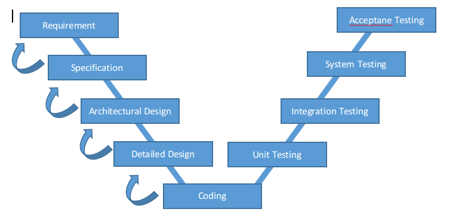
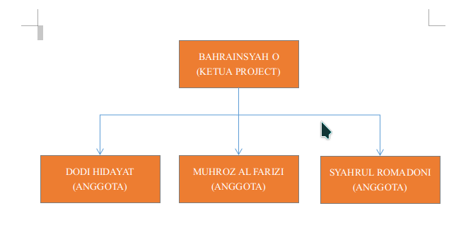

## **Software Project Manajemen Plan**

**BAB 1 Pendahuluan**

   **1.1 Gambaran Proyek**

   Aplikasi latihan ujian nasional SMK berbasis mobile ini dikembangkan untuk memudahkan siswa SMK dalam belajar maupun untuk mengevaluasi mata pelajaran guna menghadapi ujian nasional mendatang. Didalam aplikasi ini tidak hanya disediakan latihan soal saja namun disertakan chat room untuk diskusi kelompok.

   **1.2 Dokumen Dokumen dalam Proyek**

   **1.3 Evolusi SPMP**

   i.     Pendahuluan - Deskripsi pendahuluan

   ii.    Gambaran Proyek - Deskripsi proyek mobile app

   iii.    Definisi dan Akronim - Daftar singkatan yang dipakai

   **1.4 Material Acuan**

   **1.5 Definisi dan Akronim \(Singkatan\)**

   Firebase :

   AVD : Android Virtual Device

   SDK : Software Development Kit

   API   :

**BAB 2 Organisasi Proyek**

**2.1 Model Proses**

Model proses yang diterapkan pada proses pembuatan aplikasi ini ialah model V-Model karena dianggap cukup mudah dalam setiap langkahnya. Model V-Model sendiri memudahkan perancang ketika terjadi suatu perubahan yang memungkinkan kembali ke proses sebelumnya. Berikut Uraiannya :

	a)	Requirement 			: Menentukan permintaan sistem yang akan dibuat 								  berdasarkan batasan masalah yang ada.

	b)	Specification 			: Menentukan spesifikasi sistem aplikasi yang 									akan dibuat agar dapat memenuhi permintaan.

	c)	Architectural Design	: Mendesain arsitektur sistem beserta alur 									  kerja dari setiap bagian sistem.

	d)	Detailed Design			: Mendesain detail dari aplikasi beserta 									  membuat asset - asset yang terdapat pada 									  aplikasi.

	e)	Coding					: Membangun sistem aplikasi dengan menggunakan 									 code program 

	f)	Unit Testing			: Menguji setiap unit bagian dari sistem 									  aplikasi.

	g)	Integration Testing		: Menguji hubungan antara satu bagian sistem 								   dengan bagian yang lainnya.

	h)	System Testing			: Menguji sistem secara keseluruhan.

	i)	Acceptane Testing		: Menguji sistem aplikasi pada lingkungan 									  client apakah sesuai dengan permintaan atau tidak.

**2.2 Struktur Organisasi**

Gambar 2.1 Struktur Organisasi

**2.3 Batasan dan Antarmuka Organisasi**

  Pembatasan masalah Proyek 2 hanya masih blm di sebarluaskan ke playstore dan sekolah-sekolahlain selain mitra yang kami tanganni 

**2.4 Lingkup Tanggung Jawab**
1. Bahrainsyah Oksareinaldi : Project Leader, Coding Fungsi System.
	. Dodi Hidayat				: Alur System, Database, Coding.
	. Muhroz Al Farizi			: Database.
	. Syahrul Romadoni			: UI Design, System.

**BAB 3 Proses Menajerial** 

**3.1 Tujuan dan prioritas manajemen**

  Tujuan dari proyek ini adalah supaya siswa/siswi smk yang mau UN bisa latihan sendiri dirumah karna aplikasi ini bisa dibawa kemana saja.

**3.2 Asumsi-asumsi, tergantungan/kertetarikan, dan batasan-batasan**

  Asumsi-asumsi dan batasan aplikasi ini sendiri, aplikasi ini masi di silkus sekitar mitra dan belum di perluas kan atau di download di playstore.

**3.3 Manajemen resiko**

  Manajemen resikonya sendiri kita masi mengurus beberapa faktor yang kita blm di selesaikan dan memperbaiki beberapa kesalahan tersebut.

**3.4 Mekanisme monitoring dan kontroling**

  Sistem monitoring dan kontroling di pegang oleh administrator. Setiap traffic yang ada di monitor oleh admin dan ketika terjadi suatu permasalahan maka admin dapat menghubungi developer aplikasi untuk dilakukan maintance.

**3.5 Perencanaan Staff**

Rancangan staff sendiri.

Mulai dari ketua kelompok trs penangung jawab coding dan datasbases.

**BAB 4 Proses Teknis** 

**4.1 Metode, Alat, dan Teknik**

  Proyek ini akan diimplementasikan dengan memanfaatkan metodologi Water fall, dan alat seperti Android Studio, Visio, CorelDraw, Photoshop, dan Sublime akan digunakan. Teknik analisis berorientasi objek akan digunakan untuk menyelesaikan proyek dengan sukses.

**4.2 Dokumentasi Perangkat Lunak**

  Dokumentasi seperti piagam proyek, Dokumen Kebutuhan Bisnis, Dokumen Spesifikasi Fungsional, Analisis Manfaat Biaya, dokumen Spesifikasi Teknis, dokumen desain detail, Rencana Uji, Rencana Pelaksanaan, dan dokumen Realisasi Manfaat.

**4.3 Fungsi pendukung proyek**

Semua dokumen pendukung proyek akan selesai dalam fase yang sesuai.

**BAB 5 UNSUR, KERJA, dan ANGGARAN** 

**5.1 Proyek dianggarkan untuk 8 sumber daya, dan peralatan yang dibutuhkan untuk menyelesaikan analisis, implementasi, dan pengujian aplikasi.**

RENCANAANGGARAN BIAYA

PengembanganSistem Aplikasi Simulasi Ujian Berbasis Mobile

I. BIAYA LANGSUNG PERSONIL

| NO     | Keahlian                          | Volume |       | Harga Satuana | Jumlah Harga   |
| ------ | --------------------------------- | ------ | ----- | ------------- | -------------- |
|        |                                   | Jumlah | Waktu |     (Rp)      | (Rp)           |
| A.     | Biaya Tenaga Ahli                 |        |       |               |                |
| 1.     | Ahli Perancangan Sistem Informasi | 4      |   4   | Rp 3.500.000  | Rp 14.000.000  |
| 2.     | Ahli Perancangan Basis  Data      | 2      |   4   | Rp. 3000.000  | Rp. 6000.000   |
| 3.     | Ahli Pemograman Komputer          | 2      |   4   | Rp 5.000.000  | Rp. 10.000.000 |
| 4.     | Sistem Analis                     | 1      |   4   | Rp. 3.000.000 | Rp. 3.000.000  |
| Jumlah | Rp. 33.000.000                    |        |       |               |                |

II. BIAYA LANGSUNG NON PERSONIL

| No     | Keahlian                            | Volume |         | Harga satuan  | Jumlah harga   |
| ------ | ----------------------------------- | ------ | ------- | ------------- | -------------- |
|        |                                     | Jumlah | Waktu   | (Rp)          | (Rp)           |
| A.     | Biaya Perangkat Lunak dan Pelatihan |        |         |               |                |
| 1.     | Komputer atau laptop                | 4      |         | Rp. 9.000.000 | Rp. 36.000.000 |
| 2.     | Dokumentasi                         | 4Ls    |         |               | Rp. 1000.000   |
| 3.     | Software CorelDraw X7 Original      | 1      | 1 Tahun | Rp. 1.150.000 | Rp. 1.150.000  |
| 4.     | Software Photoshop CC original      | 1      | 1 Tahun | Rp. 3.460.000 | Rp. 3.460.000  |
| 5.     | Akun Google Play                    | 1      | 1 tahun | Rp. 300.000   | Rp. 300.000    |
| Jumlah | Rp. 41.910.000                      |        |         |               |                |

 **5.2 Prospek proyek akan diputar untuk setiap fase dari 4 anggota tim.**

 **5.3 Dokumen untuk semua tahap akan direvisi pada fase berikutnya jika berlaku**

